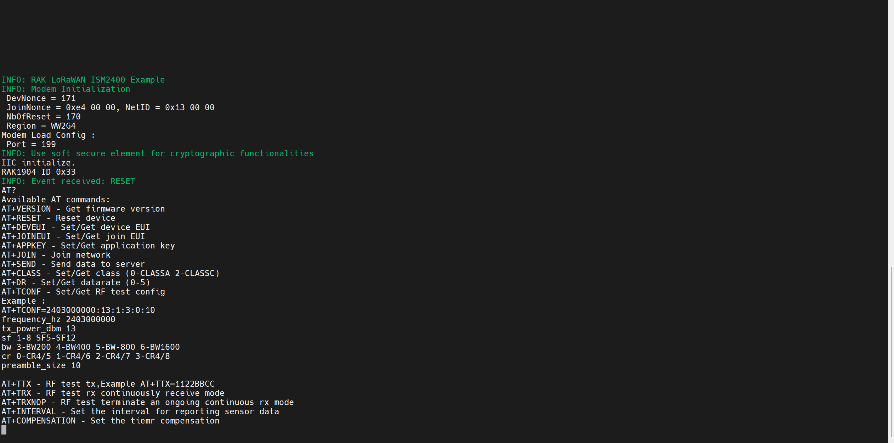
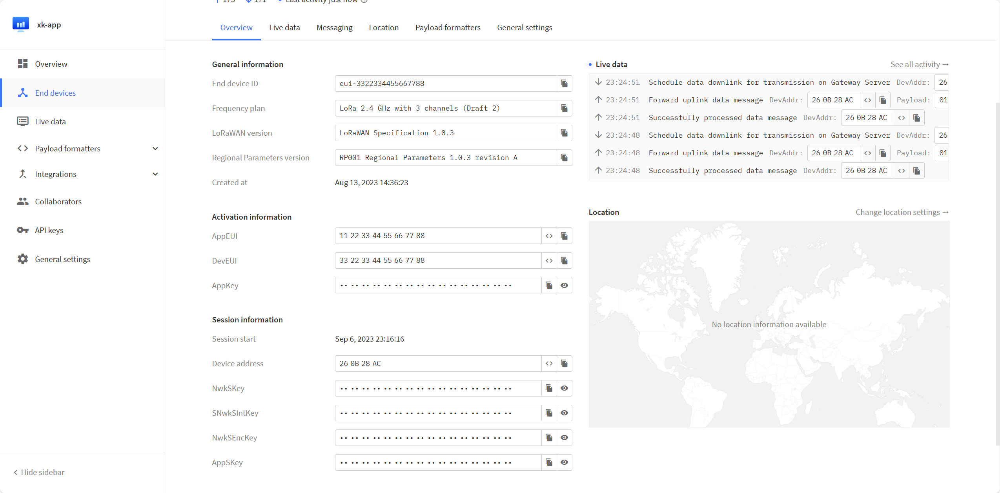

# RAK3183 2.4G LoRaWAN Node Project
RAK LoRaWAN ISM2400 Project 
[TOC] 

## Hardware specificities
RAK3183 is a 2.4G LoRaWAN wireless module , It also supports BLE5 ，Module is composed of MCU plus SX1280, MCU is apollo3 ble, and communicates with SX1280 through SPI, SX1280 supports 2.4G LoRa modulation.Support TTN 2.4G.Support the AT command to configure the 2.4G LoRaWAN parameters.The firmware supports RAK1904(LIS3DH), which can upload data through LPP format periodically.  
 
## Software development 
### Development tool 
keil5  support
arm-gcc-none-eabi : Will soon support
### Project path  
./boards/RAK3183/examples/LoRaWAN_ISM2400/keil/
### Firmware path
./firmware/
RAK3183 supports SWD interface.

## Protocol
Physical_Layer_Proposal_2.4GHz  
https://lora-developers.semtech.com/documentation/tech-papers-and-guides/physical-layer-proposal-2.4ghz/
## AT Commands
Baudrate 115200 , suggest using mobaxterm , implicit CR in every LF

AT+VERSION - Get firmware version 
AT+RESET - Reset device 
AT+DEVEUI - Set/Get device EUI
AT+JOINEUI - Set/Get join EUI
AT+APPKEY - Set/Get application key
AT+JOIN - Join network

AT+SEND - Send data to server 
Usage: AT+SEND=PORT:CONFIRM:payload
Parameters:
PORT: an integer between 1 and 223 that represents the port number of the packet.  
CONFIRM: a boolean value that indicates whether the data needs to be confirmed. It can be 0 (not confirmed) or 1 (confirmed).  
payload: the data payload to be sent. It must be a hexadecimal-encoded string.  
Examples:
Send an unconfirmed packet with port number 10 and payload "48656C6C6F":  
AT+SEND=10:0:48656C6C6F  
Send a confirmed packet with port number 3 and payload "010203":  
AT+SEND=3:1:010203  

AT+CLASS - Set/Get class (0-CLASSA 2-CLASSC)  
AT+DR - Set/Get datarate (0-5)  
AT+TCONF - Set/Get RF test config  
Usage: AT+TCONF=2403000000:13:1:3:0:10  
Parameters:  
frequency_hz 2403000000     
tx_power_dbm 13    
sf 1-8 SF5-SF12    
bw 3-BW200 4-BW400 5-BW-800 6-BW1600  
cr 0-CR4/5 1-CR4/6 2-CR4/7 3-CR4/8  
preamble_size 10  

AT+TTX - RF test tx  
AT+TRX - RF test rx continuously receive mode  
AT+TRXNOP - RF test terminate an ongoing continuous rx mode   
AT+INTERVAL - Set the interval for reporting sensor data（Hardware must support RAK1904）  

## Quick start guide
### Gateway
The gateway can use RAK5148 module, which can be used with RAK7391 or Raspberry PI.Start packet-forwarder and connect to TTN server.  
RAK5148 WisLink LPWAN 2.4 GHz Concentrator Module.  
https://docs.rakwireless.com/Product-Categories/WisLink/RAK5148/Overview/#product-description
RAK7391 WisGate Connect  
https://docs.rakwireless.com/Product-Categories/WisGate/RAK7391/Overview/#product-description

### Network Server
Registered gateway and node, the node selection LoRa 2.4 G frequency plan.  
https://eu1.cloud.thethings.network/console  

### RAK3183 Serial 

## RF Test Mode
Through the RF test mode, two RAK3183 can communicate with each other point-to-point without the need of a gateway.

## LIS3DH Data Uplink
RAK1904 WisBlock 3-Axis Acceleration Sensor Module  
https://docs.rakwireless.com/Product-Categories/WisBlock/RAK1904/Quickstart/  

