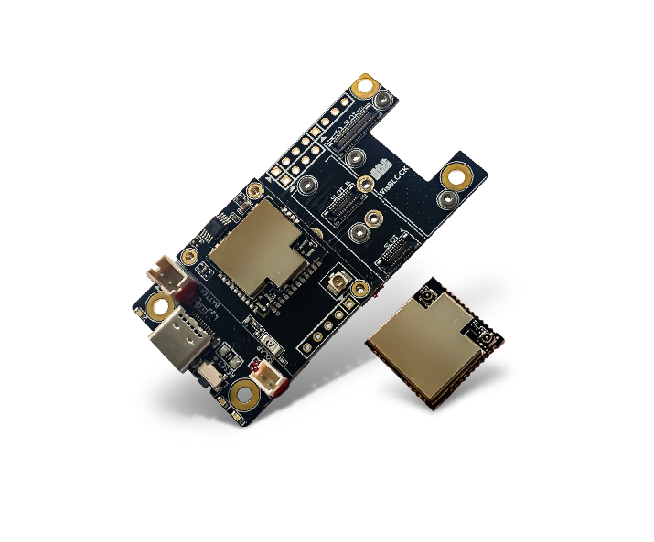
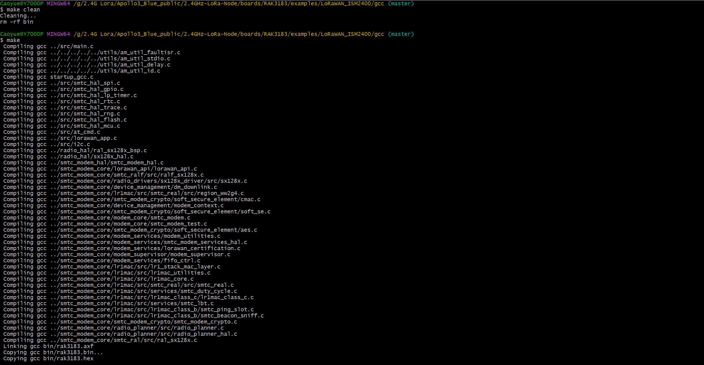
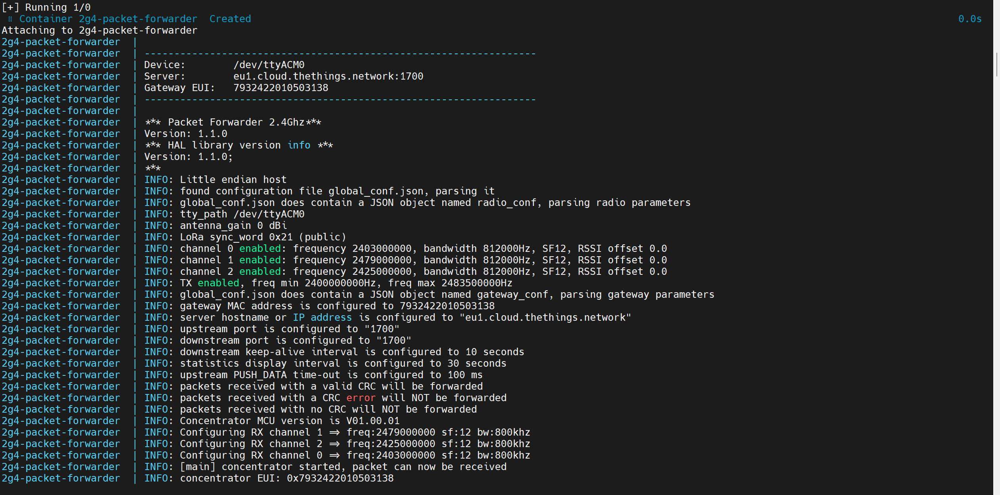

# RAK3183 2.4G LoRaWAN Node Project

RAK LoRaWAN ISM2400 Project  

## Hardware specificities

RAK3183 is a 2.4G LoRaWAN wireless module that also supports BLE5. Module is composed of an Ambiq Apollo 3 Blue MCU plus a Semtech SX1280 transceiver that supports 2.4G LoRa modulation. The MCU communicates with the SX1280 through SPI.

The firmware supports AT command to configure the 2.4G LoRaWAN parameters and send messages. The firmware also supports RAK1904 accelerometer (LIS3DH), which can upload data through LPP format periodically.  

The example below uses this module with a 2.4 GHz LoRaWAN gateway connected to TTN.

 

## Software development 

### Development tools

* keil5 
* arm-gcc-none-eabi: https://developer.arm.com/downloads/-/gnu-rm

 

### Project path  

`./boards/RAK3183/examples/LoRaWAN_ISM2400/keil/`
`./boards/RAK3183/examples/LoRaWAN_ISM2400/gcc/`

### Firmware path

`./firmware/`

### Flashing firmware

RAK3183 supports SWD interface.

## Protocol

Physical_Layer_Proposal_2.4GHz: https://lora-developers.semtech.com/documentation/tech-papers-and-guides/physical-layer-proposal-2.4ghz/

## AT Commands

Serial port configuration (suggest using mobaxterm):
* baudrate 115200
* implicit CR in every LF

* AT+VERSION - Get firmware version 
* AT+RESET - Reset device 
* AT+DEVEUI - Set/Get device EUI
* AT+JOINEUI - Set/Get join EUI
* AT+APPKEY - Set/Get application key
* AT+JOIN - Join network
* AT+CFM - Set/Get comfirm mode
* AT+SEND - Send data to server 

    Usage: `AT+SEND=PORT:CONFIRM:PAYLOAD`
    
    Parameters:
    * PORT: an integer between 1 and 223 that represents the port number of the packet.  
    * CONFIRM: a boolean value that indicates whether the data needs to be confirmed. It can be 0 (not confirmed) or 1 (confirmed).  
    * PAYLOAD: the data payload to be sent. It must be a hexadecimal-encoded string.  
    
    Examples:
    * Send a packet with port number 3 and payload "010203": `AT+SEND=3:010203`

* AT+CLASS - Set/Get class (0-CLASSA 2-CLASSC)  
* AT+DR - Set/Get datarate (0-5)  
* AT+TCONF - Set/Get RF test config  

    Usage: `AT+TCONF=FREQUENCY:TX_POWER:SF:BW:CR:PREAMBLE_SIZE`
    
    Parameters:  
    * FREQUENCY in Hz: 2403000000 | 2425000000 | 2479000000
    * TX_POWER
    * SF: 1-SF5 to 8-SF12
    * BW: 3-BW203 4-BW406 5-BW-812 6-BW1625
    * CR: 0-CR4/5 1-CR4/6 2-CR4/7 3-CR4/8
    * PREAMBLE_SIZE: 10

    Examples:
    * `AT+TCONF=2403000000:13:1:3:0:10`

* AT+TTX - RF test tx  
* AT+TRX - RF test rx continuously receive mode  
* AT+TRXNOP - RF test terminate an ongoing continuous rx mode   
* AT+INTERVAL - Set the interval for reporting sensor data（hardware must support RAK1904）  
* AT+HWMODEL - Get the string of the hardware mode
* AT+HWID - Get the string of the hardware ID
* AT+NJM - Get or set the network join mode (0 = OTAA, 1 = ABP)
* AT+DEVADDR - Get or set the device address (4 bytes in hex)
* AT+NWKSKEY - Get or set the network session key (16 bytes in hex)
* AT+APPSKEY - Get or set the application session key (16 bytes in hex)
* AT+NJS - Get the join status (0 = not joined, 1 = joined),
* AT+CFM - Set/Get comfirm mode
* AT+CFS - Get the confirmation status of the last AT+SEND (0 = failure, 1 = success)
* AT+RETY - Set/Get the number of retransmissions of Confirm packet data (1-15)

## Quick start guide

### Gateway

The gateway can use RAK5148 concentrator module, which can be used with RAK7391 or Raspberry PI. Start packet-forwarder and connect to TTN server.  

RAK5148 WisLink LPWAN 2.4 GHz Concentrator Module: https://docs.rakwireless.com/Product-Categories/WisLink/RAK5148/Overview/#product-description

RAK7391 WisGate Connect: https://docs.rakwireless.com/Product-Categories/WisGate/RAK7391/Overview/#product-description

### Network Server

Registered gateway and node, the node selection LoRa 2.4 GHz frequency plan.  

https://eu1.cloud.thethings.network/console  

### RAK3183 Serial 

## RF Test Mode

Through the RF test mode, two RAK3183 can communicate with each other point-to-point without the need of a gateway.

## LIS3DH Data Uplink

After successfully join to the server, use `AT+INTERVAL=<seconds>` to report the value of the three-axis accelerometer at given intervals, note that the hardware must support RAK1904. `AT+INTERVAL=0` will disable sending the accelerometer data.

RAK1904 WisBlock 3-Axis Acceleration Sensor Module: https://docs.rakwireless.com/Product-Categories/WisBlock/RAK1904/Quickstart/  

